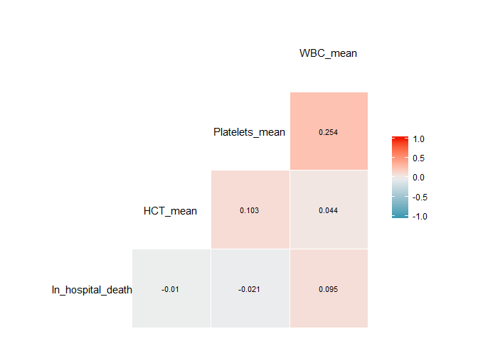
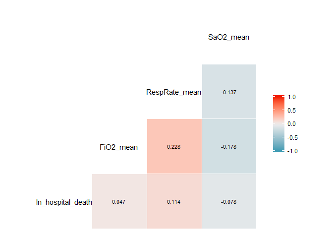
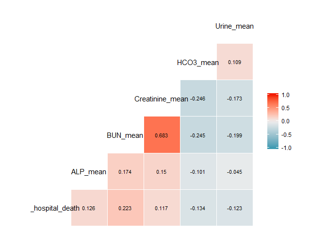
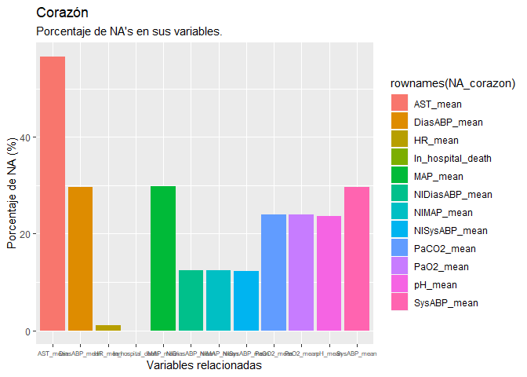
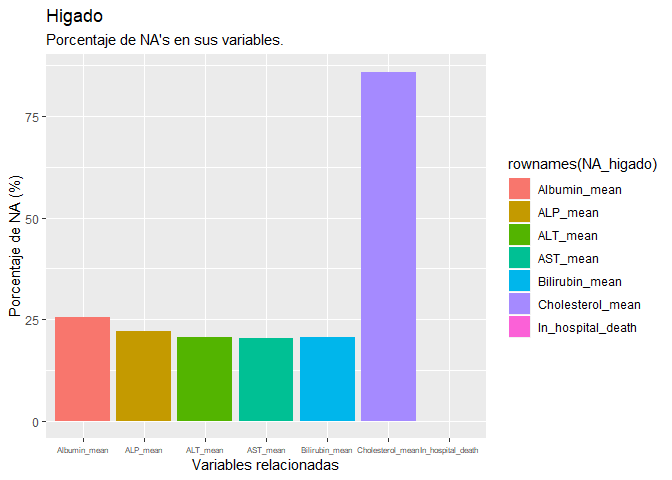
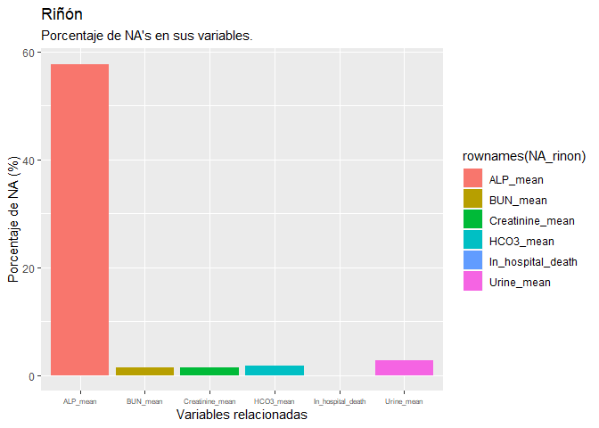
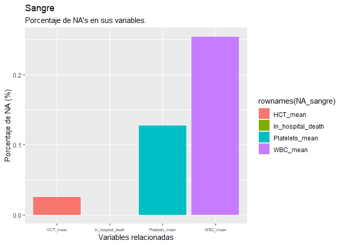
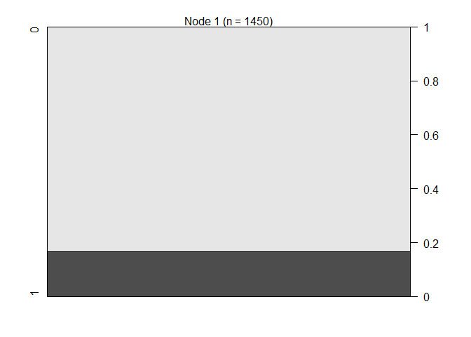
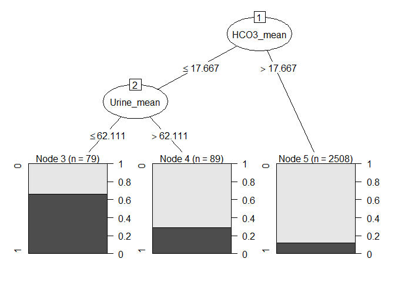

# Introducción: Physionet 2012 UCI data mortality

En el concurso del congreso ["Computers in  Cardiology" (ahora "Computing in Cardiology") del año 2012](https://physionet.org/content/challenge-2012/) propuso un  caso de estudio como reto: *Predicción de la tasa de mortalidad de los pacientes de una UCI*

Resto de años mas recientes 

* https://physionet.org/content/challenge-2018/
* https://physionet.org/content/challenge-2019/


##   Enlaces de interés

[**HR**: Heart Rate bpm beats per minut](https://en.wikipedia.org/wiki/Heart_rate)

[**GCS**: Glasgow Comma Score (scale 3-15)](https://en.wikipedia.org/wiki/Glasgow_Coma_Scale)

[**RespRate**:  Respiration rate (bpm) breaths for one minute](https://en.wikipedia.org/wiki/Respiratory_rate)


# The Research Question

Con los datos que disponemos, se puede predecir "la muerte en hospital" (in hospital death) de muchas formas. Pero en nuestro caso se ha decidio hacer algo un tanto distinto. Se intentará averiguar la influencia de los distintos órganos relacionados con nuestras variables con el fallecimiento en el hospital. Es decir, se tratará de definir en que medida los problemas derivados de un órgano en concreto se encuentran relacionadas con la muerte en hospital.

Para ello, se clasificarán las variables en grupos según al órgano al que pertenezcan. Una vez se tengan los grupos, se escogerá el modelo adecuado y se predecirá la variable "muerte en hospital" con cada grupo de variables. El grupo con mayor porcentaje de aciertos será el órgano que tenga más probabilidades de ser un órgano crítico.


# Ingesta de datos

Después de hacer un ejercicio de investigación, se han detectado 5 grupos de variables, y por tanto 5 órganos, mayoritarios:

## Variables relacionados con el **corazón**:

*  **AST.** Aspartate transaminase
*  **DiasABP.** Invasive diastolic arterial blood pressure
*  **HR.** Hearth Rate
*  **MAP.** Invasive mean arterial blood pressure
*  **NIDiasABP.** Non-invasive diastolic arterial blood pressure
*  **NIMAP.** Non-invasive mean arterial blood pressure
*  **NISysABP.** Non-invasive systolic arterial blood pressure
*  **PaCO2.** Partial pressure of arterial CO2
*  **PaO2.**	Partial pressure of arterial O2
*  **pH.**	Arterial pH
*  **SysABP.** Invasive systolic arterial blood pressure
*  **TropT.** Troponin-T

## Variables relacionadas con el **hígado**:

* **Albumin.** Albumin
* **ALP.** Alkaline phosphatase
* **ALT.** Alanine transaminase
* **AST.** Aspartate transaminase
* **Bilirubin.** Bilirubin
* **Cholesterol.** Cholesterol

## Variables relacionadas con el **riñón**:

* **ALP.** Alkaline phosphatase
* **BUN.** Blood urea nitrogen
* **Creatinine.**	Creatinine
* **HCO3.**	Serum bicarbonate
* **Urine.** Urine

## Variables relacionadas con la **sangre**:

* **HCT.** Hematocrit
* **Platelets.** Platelets
* **WBC.** White blood cell count

## Variables relacionadas con los **pulmones**:

* **FiO2.**	Fractional inspired O2
* **RespRate.**	Respiration rate
* **Sao2.** O2 saturation in hemoglobin

Las variables restantes que no aparecen entre estos grupos han sido inicialmente descartadas debido a que no ha sido posible asociarles algún órgano en concreto o que el grupo formado ha sido realmente minoritario. No se descarta que durante el transcurso del desarrollo del proyecto se utilice alguna de ellas para reforzar los sistemas según los resultados de estos.

Además, de las variables descritas no se van a utilizar muchas de ellas debido a la ausencia de estas en muchos pacientes. Para determinar el porcentaje de valores NAs de cada variable se ha utilizado una pequeño función.

## Funcion de cálculo de valores no asignados (NAs)

```r
PercentageNA <- function(df){
  na <- vector("double", ncol(df))
  names(na) = colnames(df)
  for (i in seq_along(df)) {
    na[[i]] = sum(is.na(df[i])) / nrow(df)
  }

  return (data.frame(na))
}
```

# Modelo de datos 

Con tal de recoger los datos, se utilizará el código que nos facilitó el profesor Ricardo.

La idea es generar tantos datasets como órganos queramos comparar. Todavía no se ha llegado a completar toda la ingesta de datos, pero la idea es utilizar un método similar al que planteó Ricardo. A continuación se muestra el código del profesor modificado para generar un dataset con las variables relacionadas con la sangre.


```r
path="data_basic_physionet/set-a/"# path training
lista_pacientes_set_a=dir(path) # lista  ficheros pacientes 
length(lista_pacientes_set_a) # número pacientes en training
```

```
## [1] 4000
```

## Carga set_a


```r
# lista path's  a cada  ficjero de paciente
list_files=paste0(path,lista_pacientes_set_a)
# Función leer paciente
leer_paciente=function(file) {
  read_csv(file, col_types =cols(Time=col_character(),
                                 Parameter= col_character(),
                                 Value=col_double())) %>%
    separate(Time,into=c("H","M"),sep=":") %>% 
    mutate(Time_Minutes=as.numeric(H)*60+as.numeric(M)) %>% 
    select(Time_Minutes,Parameter,Value)
}

#leer_paciente(list_files[1])

raw_data=lapply(list_files,leer_paciente)# lista de los datos por paciente

#extraer perfiles "RecordID" "Age"      "Gender"   "Height"   "Weight"   "ICUType" 
perfil=function(data_paciente){
  data_paciente %>% filter(Parameter %in% c("RecordID", "Age", "Gender", "Height", "ICUType", "Weight")) %>% select(-Time_Minutes) %>% distinct(Parameter,.keep_all=TRUE) %>% spread(Parameter,Value)
}
## ejemplo
#perfil(data_paciente_132539)
## Guardo  todos los datos  del perfil de cada paciente
perfiles=lapply(raw_data,perfil)%>% bind_rows() %>% select(RecordID, Age, Gender, Height,Weight,ICUType)
glimpse(perfiles)
```

```
## Observations: 4,000
## Variables: 6
## $ RecordID <dbl> 132539, 132540, 132541, 132543, 132545, 132547, 13254...
## $ Age      <dbl> 54, 76, 44, 68, 88, 64, 68, 78, 64, 74, 64, 71, 66, 8...
## $ Gender   <dbl> 0, 1, 0, 1, 0, 1, 0, 0, 0, 1, 0, 0, 0, 1, 1, 1, 1, 1,...
## $ Height   <dbl> -1.0, 175.3, -1.0, 180.3, -1.0, 180.3, 162.6, 162.6, ...
## $ Weight   <dbl> -1.0, 76.0, 56.7, 84.6, -1.0, 114.0, 87.0, 48.4, 60.7...
## $ ICUType  <dbl> 4, 2, 3, 3, 3, 1, 3, 3, 3, 2, 3, 2, 3, 1, 1, 2, 3, 3,...
```

```r
## Ler series
## se modifica error de time

serie_UCI_parameter<-  function(paciente,parameters){
  paciente %>% arrange(Parameter,Time_Minutes) %>% filter(Parameter %in% parameters) %>% add_column(RecordID=paciente[1,3]$Value) 
  } 

##ejemplo
#parameters = c("FiO2","RespRate","SaO2")

parameters_corazon = c("AST","DiasABP","HR","MAP","NIDiasABP","NIMAP","NISysABP","PaCO2","PaO2","pH","SysABP","TropT")
parameters_higado = c("Albumin","ALP","ALT","AST","Bilirubin","Cholesterol")
parameters_rinon = c("ALP","BUN","Creatinine","HCO3","Urine")
parameters_sangre = c("HCT","Platelets","WBC")
#parameters_pulmon = c("FiO2","RespRate","SaO2")

parameters = parameters_corazon

serie_paciente1 =serie_UCI_parameter(raw_data[[1]],parameters)
# paso parámetros y  apilo 
series_corazon = lapply(raw_data,FUN=function(x) serie_UCI_parameter(x,parameters_corazon)) %>% bind_rows()
series_higado = lapply(raw_data,FUN=function(x) serie_UCI_parameter(x,parameters_higado)) %>% bind_rows()
series_rinon = lapply(raw_data,FUN=function(x) serie_UCI_parameter(x,parameters_rinon)) %>% bind_rows()
series_sangre = lapply(raw_data,FUN=function(x) serie_UCI_parameter(x,parameters_sangre)) %>% bind_rows()
#series_pulmon = lapply(raw_data,FUN=function(x) serie_UCI_parameter(x,parameters_pulmon)) %>% bind_rows()

series_parameters = lapply(raw_data,FUN=function(x) serie_UCI_parameter(x,parameters)) %>% bind_rows()
```

## En resumen  tenemos

```
## # A tibble: 4,000 x 6
##    RecordID   Age Gender Height Weight ICUType
##       <dbl> <dbl>  <dbl>  <dbl>  <dbl>   <dbl>
##  1   132539    54      0    -1    -1         4
##  2   132540    76      1   175.   76         2
##  3   132541    44      0    -1    56.7       3
##  4   132543    68      1   180.   84.6       3
##  5   132545    88      0    -1    -1         3
##  6   132547    64      1   180.  114         1
##  7   132548    68      0   163.   87         3
##  8   132551    78      0   163.   48.4       3
##  9   132554    64      0    -1    60.7       3
## 10   132555    74      1   175.   66.1       2
## # ... with 3,990 more rows
```

```
## # A tibble: 1,033,025 x 4
##    Time_Minutes Parameter Value RecordID
##           <dbl> <chr>     <dbl>    <dbl>
##  1            7 HR           73   132539
##  2           37 HR           77   132539
##  3           97 HR           60   132539
##  4          157 HR           62   132539
##  5          217 HR           80   132539
##  6          277 HR           74   132539
##  7          337 HR           73   132539
##  8          457 HR           64   132539
##  9          517 HR           64   132539
## 10          577 HR           66   132539
## # ... with 1,033,015 more rows
```


```r
#set-a
glimpse(perfiles)
```

```
## Observations: 4,000
## Variables: 6
## $ RecordID <dbl> 132539, 132540, 132541, 132543, 132545, 132547, 13254...
## $ Age      <dbl> 54, 76, 44, 68, 88, 64, 68, 78, 64, 74, 64, 71, 66, 8...
## $ Gender   <dbl> 0, 1, 0, 1, 0, 1, 0, 0, 0, 1, 0, 0, 0, 1, 1, 1, 1, 1,...
## $ Height   <dbl> -1.0, 175.3, -1.0, 180.3, -1.0, 180.3, 162.6, 162.6, ...
## $ Weight   <dbl> -1.0, 76.0, 56.7, 84.6, -1.0, 114.0, 87.0, 48.4, 60.7...
## $ ICUType  <dbl> 4, 2, 3, 3, 3, 1, 3, 3, 3, 2, 3, 2, 3, 1, 1, 2, 3, 3,...
```

```r
glimpse(series_parameters)
```

```
## Observations: 1,033,025
## Variables: 4
## $ Time_Minutes <dbl> 7, 37, 97, 157, 217, 277, 337, 457, 517, 577, 637...
## $ Parameter    <chr> "HR", "HR", "HR", "HR", "HR", "HR", "HR", "HR", "...
## $ Value        <dbl> 73, 77, 60, 62, 80, 74, 73, 64, 64, 66, 61, 58, 5...
## $ RecordID     <dbl> 132539, 132539, 132539, 132539, 132539, 132539, 1...
```

## Unificar: series, perfiles y scores

Nos faltan los scores clásicos que se utilizan eb las ICU. Estos ewstán el fichero Outcome-a.txt para el set-a


```r
scoresApath="data_basic_physionet/Outcomes-a.txt"
scoresA=read_csv(scoresApath)
```

```
## Parsed with column specification:
## cols(
##   RecordID = col_double(),
##   `SAPS-I` = col_double(),
##   SOFA = col_double(),
##   Length_of_stay = col_double(),
##   Survival = col_double(),
##   `In-hospital_death` = col_double()
## )
```

```r
scoresA = data.frame("RecordID" = scoresA$RecordID, "In_hospital_death" = scoresA$`In-hospital_death`)
##glimpse(scoresA)
#Scores_perfilesA= inner_join(perfiles,scoresA,"RecordID")
#glimpse(Scores_perfilesA)
```

### Extracción factores de las series 

Se genera una tabla con resumenes de  las variables por paciente: media, desviación típica 
* https://rsanchezs.gitbooks.io/rprogramming/content/chapter9/summarise.html


```r
  series_summary=series_corazon %>%
  group_by(RecordID,Parameter) %>%
  #summarise(mean=mean(Value,na.rm=TRUE), min = min(Value,na.rm = TRUE))%>%
  summarise(mean=mean(Value,na.rm=TRUE))%>%
  gather(Stat, Value, mean:mean) %>%
  ungroup() %>%
  transmute(RecordID, ParameterStat=paste0(Parameter,"_",Stat), Value) %>%
  spread(ParameterStat, Value)

data_tidy_corazon = scoresA %>% inner_join(series_summary)
```

```
## Joining, by = "RecordID"
```

```r
data_tidy_corazon <- subset( data_tidy_corazon, select = -RecordID )
head(data_tidy_corazon)
```

```
##   In_hospital_death AST_mean DiasABP_mean  HR_mean MAP_mean NIDiasABP_mean
## 1                 0       NA           NA 70.81081       NA       50.14706
## 2                 0       NA     58.89706 80.79412 76.94030       56.71429
## 3                 0    199.5     67.12500 83.75926 90.43750       79.00000
## 4                 0     15.0           NA 70.98333       NA       65.05172
## 5                 0       NA           NA 74.95833       NA       45.72093
## 6                 0    104.5     73.62222 88.53191 88.68889       70.50000
##   NIMAP_mean NISysABP_mean PaCO2_mean PaO2_mean  pH_mean SysABP_mean
## 1   71.55912      114.3824         NA        NA       NA          NA
## 2   75.30857      112.5000   38.85714  210.1429 7.395000    113.4118
## 3   96.75132      132.2632   35.50000  134.5000 7.495000    125.6875
## 4   83.88552      121.5517         NA        NA       NA          NA
## 5   74.94651      133.3953         NA        NA       NA          NA
## 6   81.98500      105.0000   35.14286  110.0000 7.405714    115.6889
```

```r
nrow(data_tidy_corazon)
```

```
## [1] 3978
```

```r
ggcorr(data_tidy_corazon, label = TRUE, label_size = 3, label_round = 3)
```

<!-- -->


```r
series_summary=series_higado %>%
  group_by(RecordID,Parameter) %>%
  #summarise(mean=mean(Value,na.rm=TRUE), min = min(Value,na.rm = TRUE))%>%
  summarise(mean=mean(Value,na.rm=TRUE))%>%
  gather(Stat, Value, mean:mean) %>%
  ungroup() %>%
  transmute(RecordID, ParameterStat=paste0(Parameter,"_",Stat), Value) %>%
  spread(ParameterStat, Value)

data_tidy_higado = scoresA %>% inner_join(series_summary)
```

```
## Joining, by = "RecordID"
```

```r
data_tidy_higado <- subset( data_tidy_higado, select = -RecordID )
head(data_tidy_higado)
```

```
##   In_hospital_death Albumin_mean ALP_mean ALT_mean AST_mean Bilirubin_mean
## 1                 0          2.5      116     83.0    199.5            2.9
## 2                 0          4.4      105     12.0     15.0            0.2
## 3                 0          3.3       NA       NA       NA             NA
## 4                 0           NA      101     52.5    104.5            0.4
## 5                 1          1.9       47     46.0     82.0            0.3
## 6                 0          2.7      402     36.0     47.0            0.1
##   Cholesterol_mean
## 1               NA
## 2               NA
## 3               NA
## 4              212
## 5               NA
## 6               NA
```

```r
nrow(data_tidy_higado)
```

```
## [1] 2165
```

```r
ggcorr(data_tidy_higado, label = TRUE, label_size = 3, label_round = 3)
```

<!-- -->


```r
series_summary=series_rinon %>%
  group_by(RecordID,Parameter) %>%
  #summarise(mean=mean(Value,na.rm=TRUE), min = min(Value,na.rm = TRUE))%>%
  summarise(mean=mean(Value,na.rm=TRUE))%>%
  gather(Stat, Value, mean:mean) %>%
  ungroup() %>%
  transmute(RecordID, ParameterStat=paste0(Parameter,"_",Stat), Value) %>%
  spread(ParameterStat, Value)

data_tidy_rinon = scoresA %>% inner_join(series_summary)
```

```
## Joining, by = "RecordID"
```

```r
data_tidy_rinon <- subset( data_tidy_rinon, select = -RecordID )
head(data_tidy_rinon)
```

```
##   In_hospital_death ALP_mean  BUN_mean Creatinine_mean HCO3_mean
## 1                 0       NA 10.500000       0.7500000  27.00000
## 2                 0       NA 18.333333       1.1000000  22.33333
## 3                 0      116  4.666667       0.3333333  25.00000
## 4                 0      105 17.666667       0.7666667  27.66667
## 5                 0       NA 35.000000       1.0000000  19.00000
## 6                 0      101 16.750000       0.9750000  19.75000
##   Urine_mean
## 1  171.05263
## 2  151.56098
## 3  124.95122
## 4  545.83333
## 5   62.13158
## 6  136.33333
```

```r
nrow(data_tidy_rinon)
```

```
## [1] 3995
```

```r
ggcorr(data_tidy_rinon, label = TRUE, label_size = 3, label_round = 3)
```

<!-- -->


```r
series_summary=series_sangre %>%
  group_by(RecordID,Parameter) %>%
  #summarise(mean=mean(Value,na.rm=TRUE), min = min(Value,na.rm = TRUE))%>%
  summarise(mean=mean(Value,na.rm=TRUE))%>%
  gather(Stat, Value, mean:mean) %>%
  ungroup() %>%
  transmute(RecordID, ParameterStat=paste0(Parameter,"_",Stat), Value) %>%
  spread(ParameterStat, Value)

data_tidy_sangre = scoresA %>% inner_join(series_summary)
```

```
## Joining, by = "RecordID"
```

```r
data_tidy_sangre <- subset( data_tidy_sangre, select = -RecordID )
head(data_tidy_sangre)
```

```
##   In_hospital_death HCT_mean Platelets_mean WBC_mean
## 1                 0 32.50000      203.00000 10.30000
## 2                 0 28.65556      178.60000 11.26667
## 3                 0 28.46000       89.66667  4.70000
## 4                 0 37.44286      330.00000  9.40000
## 5                 0 29.55000      103.00000  4.30000
## 6                 0 37.22500      210.75000 16.10000
```

```r
nrow(data_tidy_sangre)
```

```
## [1] 3937
```

```r
ggcorr(data_tidy_sangre, label = TRUE, label_size = 3, label_round = 3)
```

<!-- -->

### Porcentaje NAs


```r
NA_corazon <- PercentageNA(data_tidy_corazon)
NA_higado <- PercentageNA(data_tidy_higado)
NA_rinon <- PercentageNA(data_tidy_rinon)
NA_sangre <- PercentageNA(data_tidy_sangre)

NA_corazon
```

```
##                           na
## In_hospital_death 0.00000000
## AST_mean          0.56636501
## DiasABP_mean      0.29638009
## HR_mean           0.01030669
## MAP_mean          0.29813977
## NIDiasABP_mean    0.12443439
## NIMAP_mean        0.12493715
## NISysABP_mean     0.12192056
## PaCO2_mean        0.24007039
## PaO2_mean         0.24007039
## pH_mean           0.23579688
## SysABP_mean       0.29638009
```

```r
NA_higado
```

```
##                          na
## In_hospital_death 0.0000000
## Albumin_mean      0.2540416
## ALP_mean          0.2193995
## ALT_mean          0.2050808
## AST_mean          0.2032333
## Bilirubin_mean    0.2064665
## Cholesterol_mean  0.8591224
```

```r
NA_rinon
```

```
##                           na
## In_hospital_death 0.00000000
## ALP_mean          0.57697121
## BUN_mean          0.01476846
## Creatinine_mean   0.01476846
## HCO3_mean         0.01777222
## Urine_mean        0.02803504
```

```r
NA_sangre
```

```
##                             na
## In_hospital_death 0.0000000000
## HCT_mean          0.0002540005
## Platelets_mean    0.0012700025
## WBC_mean          0.0025400051
```


#### Gráfica de NA's según el órgano

```r
NA_Plot_Corazon <-  ggplot(data=NA_corazon, aes(x=rownames(NA_corazon), y=NA_corazon$na * 100, fill=rownames(NA_corazon))) + 
                    geom_bar(stat="identity", position="stack") +
                    ggtitle("Corazón", "Porcentaje de NA's en sus variables.") +
                    labs(x = "Variables relacionadas", y = "Porcentaje de NA (%)") + 
                    theme (axis.text.x = element_text(size=rel(0.65)))

NA_Plot_Higado  <-  ggplot(data=NA_higado, aes(x=rownames(NA_higado), y=NA_higado$na * 100, fill=rownames(NA_higado))) + 
                    geom_bar(stat="identity", position="stack") +
                    ggtitle("Higado", "Porcentaje de NA's en sus variables.") +
                    labs(x = "Variables relacionadas", y = "Porcentaje de NA (%)") + 
                    theme (axis.text.x = element_text(size=rel(0.65)))

NA_Plot_Rinon   <-  ggplot(data=NA_rinon, aes(x=rownames(NA_rinon), y=NA_rinon$na * 100, fill=rownames(NA_rinon))) + 
                    geom_bar(stat="identity", position="stack") +
                    ggtitle("Riñón", "Porcentaje de NA's en sus variables.") +
                    labs(x = "Variables relacionadas", y = "Porcentaje de NA (%)") + 
                    theme (axis.text.x = element_text(size=rel(0.65)))

NA_Plot_Sangre  <-  ggplot(data=NA_sangre, aes(x=rownames(NA_sangre), y=NA_sangre$na * 100, fill=rownames(NA_sangre))) + 
                    geom_bar(stat="identity", position="stack") +
                    ggtitle("Sangre", "Porcentaje de NA's en sus variables.") +
                    labs(x = "Variables relacionadas", y = "Porcentaje de NA (%)") + 
                    theme (axis.text.x = element_text(size=rel(0.65)))
NA_Plot_Corazon
```

<!-- -->

```r
NA_Plot_Higado
```

<!-- -->

```r
NA_Plot_Rinon
```

<!-- -->

```r
NA_Plot_Sangre
```

<!-- -->

#### ¿Qué variables deberíamos mantener?

Tras realizar el cálculo de valores no asignados de cada variables según el órgano podemos detectar aquellas variables que tienen un alto porcentaje de NA's. Con tal de conseguir unos datos lo más fidedignos posibles hemos decidido eliminar aquellas variables cuyo porcentaje de NA's superase el 25%.
Así pues, las variables resultantes de cada órgano son:


**Corazón**

- HR_mean.
- NIDiasABP_mean.
- NIMAP_mean.
- NISysABP_mean.
- PaCO2_mean.
- PaO2_mean.
- pH_mean.


**Higado**

- Albumin_mean.
- ALP_mean.
- ALT_mean.
- AST_mean.
- Billirubin


**Riñón**

- BUN.
- Creatinine.
- HCO3.
- Urine.


**Sangre**:

- HCT.
- Platelets.
- WBC.


*En todas ellas se presupone la conservación de la variable a predecir in_hospital_death.*


### Selección de variables a utilizar

En las siguientes instrucciones se procede a retirar las variables que en el anterior apartada hemos visto que sobrepasan nuestro límite de NA's para cada órgano. Además, para el resto de variables que se mantienen en los distintos *datasets* se ha decidido sustituir los valores no asignados restantes por la media, de esta manera podemos seguir computando resultados sin tener que prescindir de demasiados registros.


eliminadas corazon:

- AST_mean
- DiasABP_mean.
- MAP_mean.
- SysABP_mean.


```r
data_tidy_corazon <- select(data_tidy_corazon, -AST_mean, -DiasABP_mean, -MAP_mean, -SysABP_mean)
for(i in 1:ncol(data_tidy_corazon)){
  data_tidy_corazon[is.na(data_tidy_corazon[,i]), i] <- mean(data_tidy_corazon[,i], na.rm = TRUE)
}

data_tidy_higado <- select(data_tidy_higado, -Cholesterol_mean)
for(i in 1:ncol(data_tidy_higado)){
  data_tidy_higado[is.na(data_tidy_higado[,i]), i] <- mean(data_tidy_higado[,i], na.rm = TRUE)
}

data_tidy_rinon <- select(data_tidy_rinon, -ALP_mean)
for(i in 1:ncol(data_tidy_rinon)){
  data_tidy_rinon[is.na(data_tidy_rinon[,i]), i] <- mean(data_tidy_rinon[,i], na.rm = TRUE)
}

# No se elimina ninguna variable
for(i in 1:ncol(data_tidy_sangre)){
  data_tidy_sangre[is.na(data_tidy_sangre[,i]), i] <- mean(data_tidy_sangre[,i], na.rm = TRUE)
}

PercentageNA(data_tidy_corazon)
```

```
##                   na
## In_hospital_death  0
## HR_mean            0
## NIDiasABP_mean     0
## NIMAP_mean         0
## NISysABP_mean      0
## PaCO2_mean         0
## PaO2_mean          0
## pH_mean            0
```

```r
PercentageNA(data_tidy_higado)
```

```
##                   na
## In_hospital_death  0
## Albumin_mean       0
## ALP_mean           0
## ALT_mean           0
## AST_mean           0
## Bilirubin_mean     0
```

```r
PercentageNA(data_tidy_rinon)
```

```
##                   na
## In_hospital_death  0
## BUN_mean           0
## Creatinine_mean    0
## HCO3_mean          0
## Urine_mean         0
```

```r
PercentageNA(data_tidy_sangre)
```

```
##                   na
## In_hospital_death  0
## HCT_mean           0
## Platelets_mean     0
## WBC_mean           0
```

# Fases de estudio

En primer lugar, trataremos de realizar unas predicciones no muy sofisticadas haciendo uso de un modelo clasificador de red neuronal.

Haremos uso de la siguiente función para extraer las distintas métricas de cada modelo.

```r
metrics = function(neural_net, data_test){
  pred <- predict(neural_net, data_test, type = "class")
  
  conf_Matrix <- table(prediction = pred, actual = data_test$In_hospital_death)
  
  accuracy <- sum(diag(conf_Matrix))/sum(conf_Matrix)
  cat(sprintf("Accuracy: %f", accuracy))
  
  precision <- conf_Matrix[1,1]/sum(conf_Matrix[,1])
  cat(sprintf("\nPrecision C1: %f", precision))
  
  if(nrow(conf_Matrix) > 1){
    precision <- conf_Matrix[2,2]/sum(conf_Matrix[,2])
    cat(sprintf("\nPrecision C2: %f", precision))
  }else{
    cat(sprintf("\nPrecision C2: 0"))
  }
  
  recall <- conf_Matrix[1,1]/sum(conf_Matrix[,1])
  cat(sprintf("\nRecall: %f", recall))
  
  return (conf_Matrix)
}
```

## División de los datasets en Training y Test, y normalización de los datos.

**CORAZÓN**

```r
nomalizar_1 <- function(x){ 
  valor_zero = (x - min(x))/(max(x)-min(x))
  return ((valor_zero*2)-1)
}
```


```r
set.seed(101)

data_norm_corazon <- as.data.frame(apply(data_tidy_corazon[, 2:8], 2, nomalizar_1))
In_hospital_death <- as.factor(data_tidy_corazon$In_hospital_death)
data_tidy_corazon <-data.frame(data_tidy_corazon[,2:8],In_hospital_death)
data_norm_corazon <- data.frame(data_norm_corazon,In_hospital_death)

# data_norm_corazon <- as.data.frame(apply(data_tidy_corazon[, 1:11], 2, nomalizar_1))

split_idx <- sample(seq_len(nrow(data_tidy_corazon)), size = 0.67*nrow(data_tidy_corazon))
data_tidy_corazon.train_set <- data_tidy_corazon[split_idx,]
data_tidy_corazon.test_set <- data_tidy_corazon[-split_idx,]

split_idx <- sample(seq_len(nrow(data_norm_corazon)), size = 0.67*nrow(data_norm_corazon))
data_norm_corazon.train_set <- data_norm_corazon[split_idx,]
data_norm_corazon.test_set <- data_norm_corazon[-split_idx,]
```

**HÍGADO**

```r
set.seed(101)

data_norm_higado <- as.data.frame(apply(data_tidy_higado[, 2:6], 2, nomalizar_1))
In_hospital_death <- as.factor(data_tidy_higado$In_hospital_death)
data_tidy_higado <-data.frame(data_tidy_higado[,2:6],In_hospital_death)
data_norm_higado <- data.frame(data_norm_higado,In_hospital_death)

# data_norm_higado <- as.data.frame(apply(data_tidy_higado[, 1:6], 2, nomalizar_1))

split_idx <- sample(seq_len(nrow(data_tidy_higado)), size = 0.67*nrow(data_tidy_higado))
data_tidy_higado.train_set <- data_tidy_higado[split_idx,]
data_tidy_higado.test_set <- data_tidy_higado[-split_idx,]

split_idx <- sample(seq_len(nrow(data_norm_higado)), size = 0.67*nrow(data_norm_higado))
data_norm_higado.train_set <- data_norm_higado[split_idx,]
data_norm_higado.test_set <- data_norm_higado[-split_idx,]
```

**RIÑÓN**

```r
set.seed(101)

data_norm_rinon <- as.data.frame(apply(data_tidy_rinon[, 2:5], 2, nomalizar_1))
In_hospital_death <- as.factor(data_tidy_rinon$In_hospital_death)
data_tidy_rinon <-data.frame(data_tidy_rinon[,2:5],In_hospital_death)
data_norm_rinon <- data.frame(data_norm_rinon,In_hospital_death)

# data_norm_rinon <- as.data.frame(apply(data_tidy_rinon[, 1:5], 2, nomalizar_1))

split_idx <- sample(seq_len(nrow(data_tidy_rinon)), size = 0.67*nrow(data_tidy_rinon))
data_tidy_rinon.train_set <- data_tidy_rinon[split_idx,]
data_tidy_rinon.test_set <- data_tidy_rinon[-split_idx,]

split_idx <- sample(seq_len(nrow(data_norm_rinon)), size = 0.67*nrow(data_norm_rinon))
data_norm_rinon.train_set <- data_norm_rinon[split_idx,]
data_norm_rinon.test_set <- data_norm_rinon[-split_idx,]
```

**SANGRE**

```r
set.seed(101)

data_norm_sangre <- as.data.frame(apply(data_tidy_sangre[, 2:4], 2, nomalizar_1))
In_hospital_death <- as.factor(data_tidy_sangre$In_hospital_death)
data_tidy_sangre <-data.frame(data_tidy_sangre[2:4],In_hospital_death)
data_norm_sangre <- data.frame(data_norm_sangre,In_hospital_death)

# data_norm_sangre <- as.data.frame(apply(data_tidy_sangre[, 1:4], 2, nomalizar_1))

split_idx <- sample(seq_len(nrow(data_tidy_sangre)), size = 0.67*nrow(data_tidy_sangre))
data_tidy_sangre.train_set <- data_tidy_sangre[split_idx,]
data_tidy_sangre.test_set <- data_tidy_sangre[-split_idx,]

split_idx <- sample(seq_len(nrow(data_norm_sangre)), size = 0.67*nrow(data_norm_sangre))
data_norm_sangre.train_set <- data_norm_sangre[split_idx,]
data_norm_sangre.test_set <- data_norm_sangre[-split_idx,]
```
## **Fase 1**: Naive Bayes estudio preliminar 


```r
library(e1071)
```

```
## Warning: package 'e1071' was built under R version 3.6.2
```

### Predicción corazón
**Datos sin normalizar**

```r
NBclassfier_corazon <- naiveBayes(
                          In_hospital_death ~ HR_mean + NIDiasABP_mean + NIMAP_mean + NISysABP_mean + PaCO2_mean + PaO2_mean + pH_mean,
                          data=data_tidy_corazon.train_set
                          )
```


```r
metrics(NBclassfier_corazon, data_tidy_corazon.test_set)
```

```
## Accuracy: 0.849962
## Precision C1: 0.970951
## Precision C2: 0.073446
## Recall: 0.970951
```

```
##           actual
## prediction    0    1
##          0 1103  164
##          1   33   13
```
**Datos normalizados**

```r
NBclassfier_corazon <- naiveBayes(
                          In_hospital_death ~ HR_mean + NIDiasABP_mean + NIMAP_mean + NISysABP_mean + PaCO2_mean + PaO2_mean + pH_mean,
                          data=data_norm_corazon.train_set
                          )
```


```r
metrics(NBclassfier_corazon, data_norm_corazon.test_set)
```

```
## Accuracy: 0.843869
## Precision C1: 0.995491
## Precision C2: 0.019608
## Recall: 0.995491
```

```
##           actual
## prediction    0    1
##          0 1104  200
##          1    5    4
```

### Predicción hígado
**Datos sin normalizar**

```r
NBclassfier_higado <- naiveBayes(
                          In_hospital_death ~ Albumin_mean + ALP_mean + ALT_mean + AST_mean + Bilirubin_mean,
                          data = data_tidy_higado.train_set,
                          )
```


```r
metrics(NBclassfier_higado, data_tidy_higado.test_set)
```

```
## Accuracy: 0.823776
## Precision C1: 0.965458
## Precision C2: 0.220588
## Recall: 0.965458
```

```
##           actual
## prediction   0   1
##          0 559 106
##          1  20  30
```

**Datos normalizados**

```r
NBclassfier_higado <- naiveBayes(
                          In_hospital_death ~ Albumin_mean + ALP_mean + ALT_mean + AST_mean + Bilirubin_mean,
                          data = data_norm_higado.train_set,
                          )
```


```r
metrics(NBclassfier_higado, data_norm_higado.test_set)
```

```
## Accuracy: 0.798601
## Precision C1: 0.944348
## Precision C2: 0.200000
## Recall: 0.944348
```

```
##           actual
## prediction   0   1
##          0 543 112
##          1  32  28
```

### Predicción Riñón

**Datos sin normalizar**

```r
NBclassfier_rinon <- naiveBayes(
                          In_hospital_death ~ BUN_mean + Creatinine_mean + HCO3_mean + Urine_mean,
                          data = data_tidy_rinon.train_set
                          )
```


```r
metrics(NBclassfier_rinon, data_tidy_rinon.test_set)
```

```
## Accuracy: 0.819560
## Precision C1: 0.914634
## Precision C2: 0.181287
## Recall: 0.914634
```

```
##           actual
## prediction    0    1
##          0 1050  140
##          1   98   31
```
**Datos normalizados**


```r
NBclassfier_rinon <- naiveBayes(
                          In_hospital_death ~ BUN_mean + Creatinine_mean + HCO3_mean + Urine_mean,
                          data = data_norm_rinon.train_set
                          )
```


```r
metrics(NBclassfier_rinon, data_norm_rinon.test_set)
```

```
## Accuracy: 0.822593
## Precision C1: 0.926937
## Precision C2: 0.174863
## Recall: 0.926937
```

```
##           actual
## prediction    0    1
##          0 1053  151
##          1   83   32
```

### Predicción Sangre

**Datos sin normalizar**


```r
NBclassfier_sangre <- naiveBayes(
                          In_hospital_death ~ HCT_mean + Platelets_mean + WBC_mean,
                          data = data_tidy_sangre.train_set
                          )
```


```r
metrics(NBclassfier_sangre, data_tidy_sangre.test_set)
```

```
## Accuracy: 0.855385
## Precision C1: 0.981267
## Precision C2: 0.067039
## Recall: 0.981267
```

```
##           actual
## prediction    0    1
##          0 1100  167
##          1   21   12
```

**Datos normalizados**


```r
NBclassfier_sangre <- naiveBayes(
                          In_hospital_death ~ HCT_mean + Platelets_mean + WBC_mean,
                          data = data_norm_sangre.train_set
                          )
```


```r
metrics(NBclassfier_sangre, data_norm_sangre.test_set)
```

```
## Accuracy: 0.849231
## Precision C1: 0.970641
## Precision C2: 0.073864
## Recall: 0.970641
```

```
##           actual
## prediction    0    1
##          0 1091  163
##          1   33   13
```


## **Fase 2**: Tree classification

Los árboles nos permiten escoger los orgános que son más determinantes para el in_hospital_death. Fase para descartar uno o más orgános por completo. 


```r
library(C50)
```

```
## Warning: package 'C50' was built under R version 3.6.2
```
``

### Predicción Corazón

**Datos sin normalizar**

```r
tree_corazon <- C5.0(
              In_hospital_death ~ HR_mean + NIDiasABP_mean + NIMAP_mean + NISysABP_mean + PaCO2_mean + PaO2_mean + pH_mean,
              data = data_tidy_corazon.train_set
              )
plot(tree_corazon)
```

<!-- -->

```r
metrics(tree_corazon, data_tidy_corazon.test_set)
```

```
## Accuracy: 0.863671
## Precision C1: 0.992077
## Precision C2: 0.039548
## Recall: 0.992077
```

```
##           actual
## prediction    0    1
##          0 1127  170
##          1    9    7
```
**Datos normalizados**

```r
tree_corazon <- C5.0(
              In_hospital_death ~ HR_mean + NIDiasABP_mean + NIMAP_mean + NISysABP_mean + PaCO2_mean + PaO2_mean + pH_mean,
              data = data_norm_corazon.train_set
              )
plot(tree_corazon)
```

<!-- -->

```r
metrics(tree_corazon, data_norm_corazon.test_set)
```

```
## Accuracy: 0.841584
## Precision C1: 0.992786
## Precision C2: 0.019608
## Recall: 0.992786
```

```
##           actual
## prediction    0    1
##          0 1101  200
##          1    8    4
```


### Predicción Higado
**Datos sin normalizar**

```r
tree_higado <- C5.0(
              In_hospital_death ~ Albumin_mean + ALP_mean + ALT_mean + AST_mean + Bilirubin_mean,
              data = data_tidy_higado.train_set
              )
plot(tree_higado)
```

<!-- -->


```r
metrics(tree_higado, data_tidy_higado.test_set)
```

```
## Accuracy: 0.809790
## Precision C1: 1.000000
## Precision C2: 0.000000
## Recall: 1.000000
```

```
##           actual
## prediction   0   1
##          0 579 136
##          1   0   0
```
**Datos normalizados**


```r
tree_higado <- C5.0(
              In_hospital_death ~ Albumin_mean + ALP_mean + ALT_mean + AST_mean + Bilirubin_mean,
              data = data_norm_higado.train_set,
              control = C5.0Control(minCases = 1, CF = 0.0005)
              )
plot(tree_higado)
```

<!-- -->


```r
metrics(tree_higado, data_norm_higado.test_set)
```

```
## Accuracy: 0.804196
## Precision C1: 1.000000
## Precision C2: 0.000000
## Recall: 1.000000
```

```
##           actual
## prediction   0   1
##          0 575 140
##          1   0   0
```

### Predicción Riñón

**Datos sin normalizar**

```r
tree_rinon <- C5.0(
              In_hospital_death ~ BUN_mean + Creatinine_mean + HCO3_mean + Urine_mean,
              data = data_tidy_rinon.train_set
              )
plot(tree_rinon)
```

<!-- -->


```r
metrics(tree_rinon, data_tidy_rinon.test_set)
```

```
## Accuracy: 0.874905
## Precision C1: 0.986063
## Precision C2: 0.128655
## Recall: 0.986063
```

```
##           actual
## prediction    0    1
##          0 1132  149
##          1   16   22
```
**Datos normalizados**

```r
tree_rinon <- C5.0(
              In_hospital_death ~ BUN_mean + Creatinine_mean + HCO3_mean + Urine_mean,
              data = data_norm_rinon.train_set
              )
plot(tree_rinon)
```

<!-- -->


```r
metrics(tree_rinon, data_norm_rinon.test_set)
```

```
## Accuracy: 0.862775
## Precision C1: 0.980634
## Precision C2: 0.131148
## Recall: 0.980634
```

```
##           actual
## prediction    0    1
##          0 1114  159
##          1   22   24
```


### Predicción Sangre

**Datos sin normalizar**

```r
tree_sangre <- C5.0(
              In_hospital_death ~ HCT_mean + Platelets_mean + WBC_mean,
              data = data_tidy_sangre.train_set
              )
plot(tree_sangre)
```

<!-- -->


```r
metrics(tree_sangre, data_tidy_sangre.test_set)
```

```
## Accuracy: 0.862308
## Precision C1: 1.000000
## Precision C2: 0.000000
## Recall: 1.000000
```

```
##           actual
## prediction    0    1
##          0 1121  179
##          1    0    0
```

**Datos normalizados**

```r
tree_sangre <- C5.0(
              In_hospital_death ~ HCT_mean + Platelets_mean + WBC_mean,
              data = data_norm_sangre.train_set
              )
plot(tree_sangre)
```

<!-- -->


```r
metrics(tree_sangre, data_norm_sangre.test_set)
```

```
## Accuracy: 0.864615
## Precision C1: 1.000000
## Precision C2: 0.000000
## Recall: 1.000000
```

```
##           actual
## prediction    0    1
##          0 1124  176
##          1    0    0
```

## **Fase 3**: Association Rules

Dentro de los organos escogidos en la fase anterior (Corazón y Riñón) identificamos las variables que más influencia tienen en la muerte en hospital para cada órgano. Para ello haremos uso de las association rules.

```r
library(arules)
```

```
## Warning: package 'arules' was built under R version 3.6.2
```

```
## Loading required package: Matrix
```

```
## 
## Attaching package: 'Matrix'
```

```
## The following objects are masked from 'package:tidyr':
## 
##     expand, pack, unpack
```

```
## 
## Attaching package: 'arules'
```

```
## The following object is masked from 'package:dplyr':
## 
##     recode
```

```
## The following objects are masked from 'package:base':
## 
##     abbreviate, write
```

```r
library(arulesViz)
```

```
## Warning: package 'arulesViz' was built under R version 3.6.2
```

```
## Loading required package: grid
```

```
## Registered S3 method overwritten by 'seriation':
##   method         from 
##   reorder.hclust gclus
```
### Reglas del Corazón

```r
corazon_rules <- apriori(data = data_norm_corazon, 
                         parameter = list (supp=0.001,conf = 0.80),
                        
                         appearance = list (rhs="In_hospital_death=1")
                         )
```

```
## Warning: Column(s) 1, 2, 3, 4, 5, 6, 7 not logical or factor. Applying
## default discretization (see '? discretizeDF').
```

```
## Apriori
## 
## Parameter specification:
##  confidence minval smax arem  aval originalSupport maxtime support minlen
##         0.8    0.1    1 none FALSE            TRUE       5   0.001      1
##  maxlen target   ext
##      10  rules FALSE
## 
## Algorithmic control:
##  filter tree heap memopt load sort verbose
##     0.1 TRUE TRUE  FALSE TRUE    2    TRUE
## 
## Absolute minimum support count: 3 
## 
## set item appearances ...[1 item(s)] done [0.00s].
## set transactions ...[23 item(s), 3978 transaction(s)] done [0.00s].
## sorting and recoding items ... [23 item(s)] done [0.00s].
## creating transaction tree ... done [0.00s].
## checking subsets of size 1 2 3 4 5 6 7 8 done [0.02s].
## writing ... [5 rule(s)] done [0.00s].
## creating S4 object  ... done [0.00s].
```

```r
corazon_rules
```

```
## set of 5 rules
```

```r
inspect(sort(corazon_rules, by = "confidence"))
```

```
##     lhs                             rhs                      support confidence     lift count
## [1] {HR_mean=[-0.205,0.0466),                                                                 
##      NIDiasABP_mean=[-1,-0.012),                                                              
##      NISysABP_mean=[-1,-0.0598),                                                              
##      PaCO2_mean=[-0.402,1],                                                                   
##      pH_mean=[-0.982,1]}         => {In_hospital_death=1} 0.00100553        0.8 5.744404     4
## [2] {HR_mean=[-0.205,0.0466),                                                                 
##      NIDiasABP_mean=[-1,-0.012),                                                              
##      NIMAP_mean=[-1,0.0818),                                                                  
##      PaCO2_mean=[-0.402,1],                                                                   
##      pH_mean=[-0.982,1]}         => {In_hospital_death=1} 0.00100553        0.8 5.744404     4
## [3] {HR_mean=[-0.205,0.0466),                                                                 
##      NIDiasABP_mean=[-1,-0.012),                                                              
##      NIMAP_mean=[-1,0.0818),                                                                  
##      NISysABP_mean=[-1,-0.0598),                                                              
##      PaCO2_mean=[-0.402,1],                                                                   
##      pH_mean=[-0.982,1]}         => {In_hospital_death=1} 0.00100553        0.8 5.744404     4
## [4] {HR_mean=[-1,-0.205),                                                                     
##      NIDiasABP_mean=[-1,-0.012),                                                              
##      NIMAP_mean=[0.0818,0.186),                                                               
##      PaCO2_mean=[-0.402,1],                                                                   
##      PaO2_mean=[-0.485,1],                                                                    
##      pH_mean=[-0.983,-0.982)}    => {In_hospital_death=1} 0.00100553        0.8 5.744404     4
## [5] {HR_mean=[-1,-0.205),                                                                     
##      NIDiasABP_mean=[-1,-0.012),                                                              
##      NIMAP_mean=[0.0818,0.186),                                                               
##      NISysABP_mean=[0.0342,1],                                                                
##      PaCO2_mean=[-0.402,1],                                                                   
##      PaO2_mean=[-0.485,1],                                                                    
##      pH_mean=[-0.983,-0.982)}    => {In_hospital_death=1} 0.00100553        0.8 5.744404     4
```


### Reglas del Riñon

```r
rinon_rules <- apriori(data = data_norm_rinon, 
                         parameter = list (supp=0.001,conf = 0.5),
                        
                         appearance = list (rhs="In_hospital_death=1")
                         )
```

```
## Warning: Column(s) 1, 2, 3, 4 not logical or factor. Applying default
## discretization (see '? discretizeDF').
```

```
## Apriori
## 
## Parameter specification:
##  confidence minval smax arem  aval originalSupport maxtime support minlen
##         0.5    0.1    1 none FALSE            TRUE       5   0.001      1
##  maxlen target   ext
##      10  rules FALSE
## 
## Algorithmic control:
##  filter tree heap memopt load sort verbose
##     0.1 TRUE TRUE  FALSE TRUE    2    TRUE
## 
## Absolute minimum support count: 3 
## 
## set item appearances ...[1 item(s)] done [0.00s].
## set transactions ...[14 item(s), 3995 transaction(s)] done [0.00s].
## sorting and recoding items ... [14 item(s)] done [0.00s].
## creating transaction tree ... done [0.00s].
## checking subsets of size 1 2 3 4 5 done [0.00s].
## writing ... [1 rule(s)] done [0.00s].
## creating S4 object  ... done [0.00s].
```

```r
rinon_rules
```

```
## set of 1 rules
```

```r
inspect(sort(rinon_rules, by = "confidence"))
```

```
##     lhs                              rhs                       support confidence     lift count
## [1] {BUN_mean=[-0.723,1],                                                                       
##      Creatinine_mean=[-1,-0.926),                                                               
##      HCO3_mean=[-1,-0.303),                                                                     
##      Urine_mean=[-1,-0.943)}      => {In_hospital_death=1} 0.001251564        0.5 3.605596     5
```


# Conclusión

En definitiva, tras realizar una primera inspección de los datos se ha decidido optar por la obtención de resultados según la agrupación por órganos. Tras debatir entre nosotros cúal podría resultar ser la pregunta de investigación más apropiada nos han surgido diferentes opciones:

* **¿Que influencia tiene {órgano en concreto} sobre el fallecimiento en hospital?**
* **¿Es un grupo de órganos específico el causante del fallecimiento en hospital?**

Básicamente las dos preguntas son muy similares y el punto crucial que comparten es la agrupación de variables en órganos que será en lo que nos centremos durante todo el proyecto.
Para concluir, no hemos querido seleccionar a estas alturas una sola pregunta de investigación porque queremos ver como se comportan ambas opciones al realizar el desarrollo del proyecto. Además, creemos que de esta forma sabemos hacia donde deben ir dirigidos nuestros primeros pasos pero se nos permite un cierto margen de flexibilidad.

Así pues, aunque no conozcamos todavía la pregunta exacta se podría resumir nuestro proyecto en que se tratará de llevar a cabo un análisis de los causantes de mortalidad en hospital según el órgano afectado.

